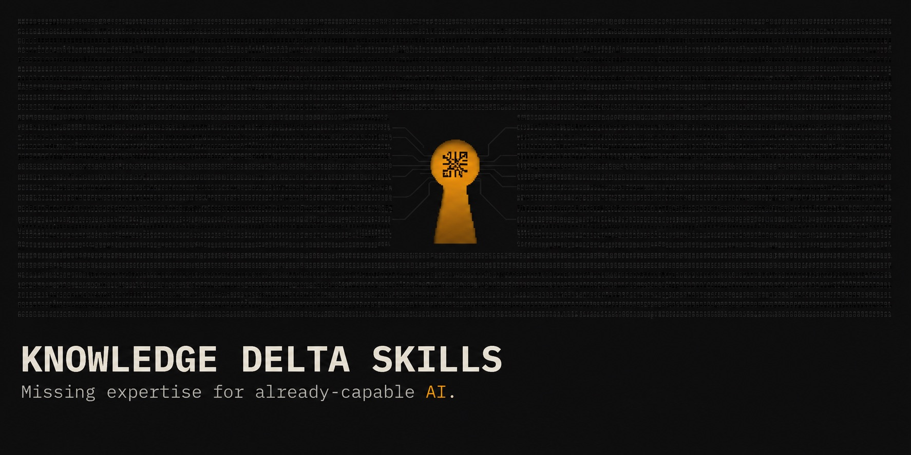

# knowledge-delta-skills

[](https://github.com/sergeyizmailov/knowledge-delta-skills/actions/workflows/ci.yml)
[](LICENSE)
[](https://agentskills.io)
[](#install)

**Not knowledge for beginners. Missing expertise for already-capable AI.**

```text
baseline what the model already does  →  research only the gaps  →  distil  →  ship the delta
```

Frontier models know the docs and textbook practice, not the platform quirk missing
from any changelog, the threshold learned by getting burned, or the failure mode a
postmortem describes and no tutorial mentions. That gap — the **knowledge delta** — is
what each skill here closes, and only that.

## Written for models that already know

The first generation of agent skills was written when models had to be told things —
what a PDF is, how a REST call works, why tests matter. That assumption expired. Claude,
GPT, Gemini, Grok, DeepSeek, Qwen, Kimi, GLM: whichever one is loading the file, most of
the public internet is already in its weights, and a skill that restates the docs spends
context teaching it what it would have produced unprompted.

Restating is not merely wasteful. Content that is topically adjacent to the task but adds
nothing degrades reasoning on that task — a redundant paragraph inside the domain the
model is working in is the most expensive place to spend a token, not a neutral one.

So the unit of a skill is no longer *the topic*. It is the **delta**: what the model gets
wrong, does not know, skips under pressure, or solves in a weaker way than an available
stronger one. The delta is per-model and it shrinks with every release — which is why
these skills carry dates, get re-baselined, and are cut when their gap closes. The method
transfers even when a particular skill stops being needed.

## This is not

- A tutorial, onboarding guide, or "learn X" walkthrough.
- A summary or reformatting of a vendor's official documentation.
- A beginner's guide — every skill assumes a competent model and a competent operator.
- A generic best-practices checklist restated in Markdown.

## Three examples

Verbatim, with the file each lives in. A competent outsider would not reliably know to
check any of them; nor would a model with no domain skill loaded.

> iOS 18 does NOT update `window.innerHeight` when address bar expands; `100vh` always
> equals `lvh` on iOS Safari.

— [`skills/responsive-adapter/references/platform-quirks.md`](skills/responsive-adapter/references/platform-quirks.md)

> Defense: resolve DNS, check IP, disable redirects, re-check on every socket connect.
> Production: dedicated egress proxy (Smokescreen, ssrfproxy) with connect-time IP
> validation — application-layer checks are racy.

— [`skills/secure-coding/ssrf.md`](skills/secure-coding/ssrf.md)

> Daily CPL (for BUYING) = click-date spend (account-tz day) ÷ that same click-date
> cohort's payout count. ... pairing click-date spend with conversion-date conversions
> is the classic apples-to-oranges CPL.

— [`skills/tracker-ops/references/03-metrics-and-math.md`](skills/tracker-ops/references/03-metrics-and-math.md)

## How these are built

- Run real tasks with no skill; record what breaks or gets skipped.
- Research only confirmed gaps, plus one bounded pass for unknown unknowns.
- Keep only rules traced to a prevented failure or an unlocked capability; compress
  hard.
- Rerun the draft; cut anything that didn't fix what it was written for.
- Broad domains: independent research + a contradiction-hunting pass before merging.

Full method, what gets cut, how volatile facts are dated: [`docs/METHODOLOGY.md`](docs/METHODOLOGY.md).

## Catalog

### Featured

| Skill | Adds |
|---|---|
| [**knowledge-delta-skill-architect**](skills/knowledge-delta-skill-architect) | Writes, audits, and compresses agent skills against the baseline-then-cut method this collection follows. |
| [**meta-ads**](skills/meta-ads) | Plans, launches, audits, and diagnoses Meta ad accounts — ODAX objectives, budgets/bidding, pixel/CAPI, policy, and a Marketing API error catalog. |
| [**deep-research**](skills/deep-research) | Runs traceable multi-source research with primary-source prioritization, verification, and explicit confidence labels. |
| [**secure-coding**](skills/secure-coding) | Applies secure defaults across JS/Node/HTML/API/auth/DB/upload code paths and flags AI-generated-code vulnerability patterns. |
| [**web-scraping**](skills/web-scraping) | Crawls and scrapes at scale past anti-bot defenses (Cloudflare, Akamai, DataDome, PerimeterX) using Crawl4AI and Camoufox. |
| [**responsive-adapter**](skills/responsive-adapter) | Adapts an existing web interface from 320px to 2560px+ without touching the visual design, then verifies across a device matrix. |

Every skill, grouped by domain — media buying, frontend, security, research,
engineering: [`CATALOG.md`](CATALOG.md).

## Install

Copy the skill directories you want into your runtime's skills folder — nothing else to configure.

```bash
git clone https://github.com/sergeyizmailov/knowledge-delta-skills.git
```

One skill:

```bash
mkdir -p ~/.claude/skills
cp -R knowledge-delta-skills/skills/meta-ads ~/.claude/skills/
```

Everything:

```bash
cp -R knowledge-delta-skills/skills/* ~/.claude/skills/
```

Personal-scope directory by runtime, verified against each vendor's docs on 2026-08-29.
Most also read a project-local equivalent, and some read each other's directories.

| Runtime | Skills directory |
|---|---|
| Claude Code | `~/.claude/skills/` |
| Codex CLI | `~/.agents/skills/` |
| Cursor | `~/.cursor/skills/` (also reads `~/.agents/skills/`) |
| Gemini CLI | `~/.gemini/skills/` (alias `~/.agents/skills/`) |
| opencode | `~/.config/opencode/skills/` (also reads `~/.claude/skills/`) |

The eight media-buying skills reference each other by name; keep them together if you
install any one of them.

## Redundancy and retirement

Base models absorb more of the internet every release. A skill earns its place only
while a real gap exists between what the model knows and what a task needs — once that
gap closes, the skill is topically-adjacent-but-useless content, not neutral filler.

No permanence promised: volatile-domain skills carry a date; a re-baseline that finds a
section already handled correctly gets that section cut, same rule as first-write.
Skills here will shrink or retire outright as their delta closes — see
[`docs/METHODOLOGY.md`](docs/METHODOLOGY.md).

## Structure

```text
skills/<name>/
├── SKILL.md        # required — frontmatter (name, description) + the workflow
├── agents/         # optional — agent-facing metadata
├── references/     # optional — on-demand docs, loaded only when needed
└── scripts/        # optional — deterministic helper scripts
```

Only `name` and `description` load for discovery; the body and supporting files load
only once a skill is selected.

## Contributing

Quality bar, skill anatomy, local checks CI runs: [CONTRIBUTING.md](CONTRIBUTING.md).

## License

[MIT](LICENSE)
